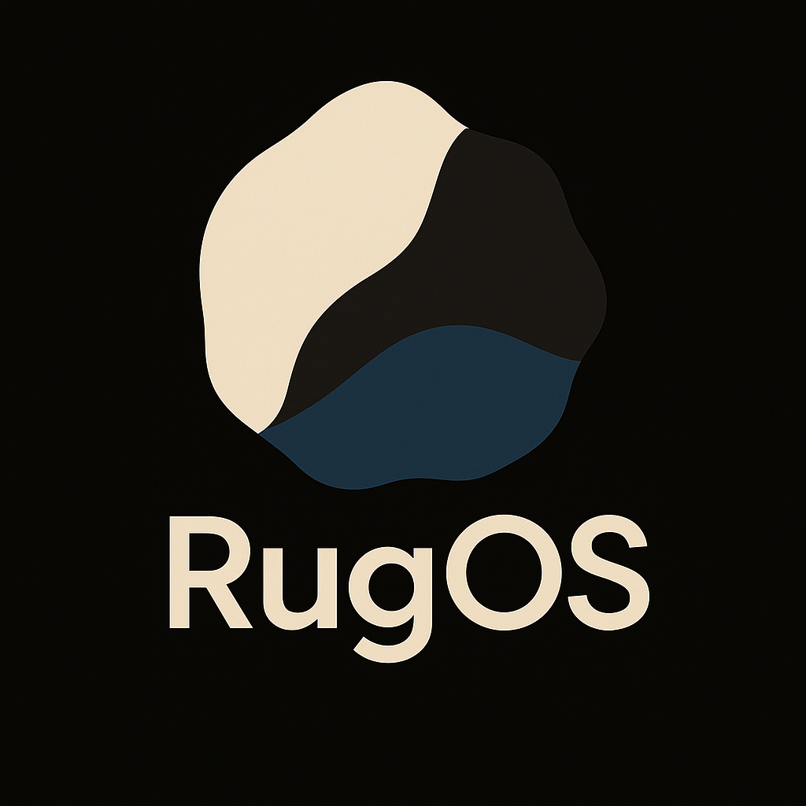

**RugOS** is a lightweight control plane for managing a distributed system of nodes using [Ansible](https://www.ansible.com/), [K3s](https://k3s.io/), [Prometheus](https://prometheus.io/), and [Grafana](https://grafana.com/). It’s infrastructure automation, monitoring, and orchestration in one cohesive pile of tooling.

This repository holds all the configuration files, playbooks, and scripts required to stand up a fully functioning, semi-obedient fleet of machines.

## 🧠 Core Components

### Distributed Architecture

RugOS organizes a distributed network of Linux nodes into a loosely-coordinated hive of chaos featuring:

- Dedicated subnet (`10.42.0.0/24`) for inter-node communication
- Control node (`rugctl`): makes decisions, issues orders, runs the show
- Worker nodes (`ruglet-*`): do the grunt work, suffer in silence
- Shared monitoring and telemetry

### Automation

[Ansible](https://docs.ansible.com/) automates everything — from provisioning to updates to the occasional ritual reboot. Write once, pray every time.

### Monitoring

Nobody likes surprises, and there will be plenty of those, so RugOS uses:

- **Prometheus** for scraping metrics
- **Grafana** for staring at graphs and pretending things are under control
- **Node Exporter** on each node to gather system-level data

#### Features:

- 15-second scrape intervals, so you can observe your failures in near real-time
- Automatic host labeling (control vs workers)
- Per-node dashboards
- Separate graph panels for CPU, memory, disk, and regrets

### Container Orchestration

[K3s](https://k3s.io/) is used for container orchestration. It’s a lightweight, fast Kubernetes distribution that boots quickly and crashes dramatically less often than expected.

- K3s server runs on `rugctl`
- Workers run as agents (with optional taints for specific deployments)
- Custom pod network on CIDR `10.44.0.0/16`
- Services deployed via `kubectl`, YAML, and hopium.

## 📡 Network Setup

### Interfaces & Internet Sharing (ICS)

RugOS assumes you’ll share internet from the control node to the ruglets over a wired NIC.

- **Wi-Fi uplink (control):** `wlp8s0` (example)
- **Wired downlink (to ruglets):** `enp9s0` (example)
- **RugOS LAN:** `10.42.0.0/24` (gateway `10.42.0.1`)

Enable ICS:
```bash
./scripts/ics.py --wifi wlp8s0 --ethernet enp9s0 --ip-range 10.42.0.0/24
```

Disable ICS:

```bash
./scripts/ics.py --clear --wifi wlp8s0 --ethernet enp9s0
```

**Note**: The script refuses to auto-pick interfaces if multiple Wi-Fi/Ethernet candidates exist. Pass `--wifi` / `--ethernet` to disambiguate.

## 🧰 Requirements

* Linux nodes (Control: Arch Linux; Workers: Ubuntu)
* SSH access via ed25519 keypair
* [Docker](https://docs.docker.com/) on the control node
* [Ansible](https://docs.ansible.com/) for provisioning

## 🚀 Deploying RugOS

1. Set up environment:

```bash
echo "K3S_TOKEN=your-randomly-generated-token-here" > .env
echo "GRAFANA_ADMIN_PASSWORD=your-secure-password-here" >> .env
```

2. Start control plane:

```bash
docker compose up --build -d
```

3. Verify node connectivity:

```bash
ansible-playbook -i ansible/inventory.yml ansible/playbooks/ping.yml
```

4. Deploy system components:

```bash
ansible-playbook ansible/playbooks/monitor_setup.yml -K
ansible-playbook ansible/playbooks/registries_setup.yml -K
ansible-playbook ansible/playbooks/k3s_kubectl_setup.yml -K
ansible-playbook ansible/playbooks/k3s_setup.yml -K
```

## 🔭 Access Points

* Grafana: [http://localhost:3000](http://localhost:3000)
* Prometheus: [http://localhost:9090](http://localhost:9090)
* Node Exporter: `http://<node>:9100/metrics`
* K3s API: `https://10.42.0.1:6443`

## 🛠️ Helpful Commands

### Kubernetes (K3s)

```bash
# List all nodes in the cluster and their status.
kubectl get nodes
```

```bash
# Get detailed information about a specific node — including conditions, resource allocations, and taints.
kubectl describe node <node-name>
```

```bash
# List every pod across all namespaces.
kubectl get pods -A
```

```bash
# Fetch logs for a pod.
kubectl logs -n <namespace> <pod-name>
```

```bash
# Print the API endpoints of the cluster.
kubectl cluster-info
```

```bash
# Show CPU and memory usage per node.
kubectl top nodes
```

### Docker

```bash
# View all running containers.
docker ps
```

```bash
# Get logs from the Prometheus container.
docker logs prometheus
```

```bash
# Restart a service.
docker restart <service>
```

```bash
# Live CPU, memory, I/O stats for each container.
docker stats
```

### Monitoring

```bash
# Check which Prometheus targets are up/down.
curl http://localhost:9090/api/v1/targets
```

```bash
# Raw output of system metrics from Node Exporter.
curl http://<ip-address>:9100/metrics
```

### Ansible

```bash
# Show all defined hosts in your inventory.
ansible all --list-hosts
```

```bash
# Full inventory dump, including vars.
ansible-inventory --list
```

```bash
# Run a shell command across all ruglet nodes.
ansible ruglets -m shell -a "uptime"
```

```bash
# Memory usage across the fleet.
ansible ruglets -m shell -a "free -m"
```

```bash
# Disk usage.
ansible ruglets -m shell -a "df -h"
```

```bash
# Check your playbook’s YAML and logic.
ansible-playbook --syntax-check ansible/playbooks/k3s_setup.yml
```

```bash
# Run the full deployment with verbose logging.
ansible-playbook -vv ansible/playbooks/k3s_setup.yml -i ansible/inventory.yml
```

```bash
# Run the playbook on a specific node only.
ansible-playbook ansible/playbooks/k3s_setup.yml --limit ruglet-1 -i ansible/inventory.yml
```

### Troubleshooting

```bash
# Ping all ruglets via Ansible.
ansible ruglets -m ping
```

```bash
# View system logs for the K3s agent on all nodes.
ansible ruglets -m shell -a "journalctl -u k3s-agent"
```

```bash
# Last 50 lines of system logs.
ansible ruglets -m shell -a "tail -n 50 /var/log/syslog"
```

## 📚 References

* [Docker Docs](https://docs.docker.com/)
* [Docker Compose Docs](https://docs.docker.com/compose/)
* [Ansible User Guide](https://docs.ansible.com/ansible/latest/user_guide/index.html)
* [Prometheus Best Practices](https://prometheus.io/docs/practices/naming/)
* [Node Exporter](https://prometheus.io/docs/guides/node-exporter/)
* [Grafana Dashboard Creation](https://grafana.com/docs/grafana/latest/dashboards/)
* [K3s Documentation](https://docs.k3s.io/)

---

**Disclaimer:** The software is provided “as is” without warranties or guarantees of any kind, express or implied. The authors are not responsible for any damages, including but not limited to data loss, system failures, hardware immolation, or existential crises resulting from its use.
